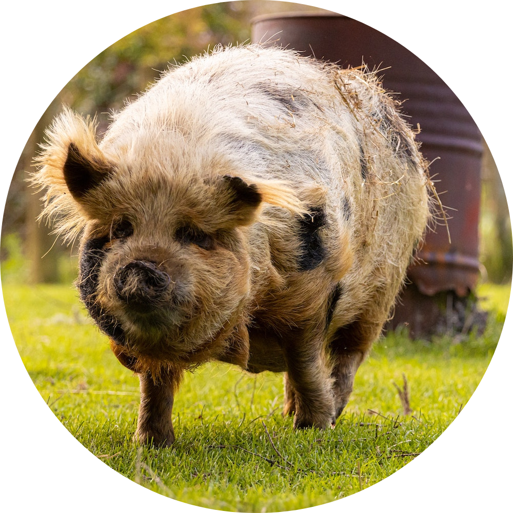
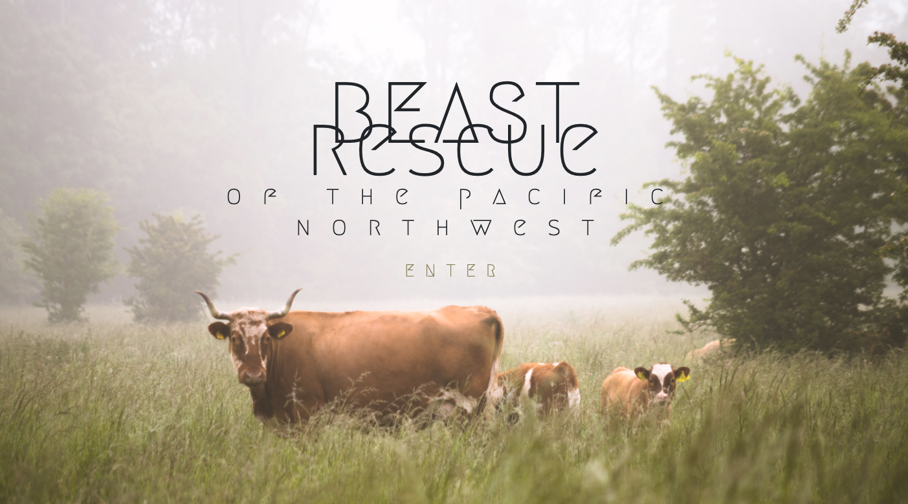

<p align="center">
<br/><br />
<big>Beast Rescue of the Pacific Northwest</big>
</p>
<p align="center">
<i>Melissa Scmi</i>
<br/>

------------------------------

<br/>
This API & companion MVC app allow users to browse, add to, & update the current animals living at Beast Rescue of the Pacific Northwest.<br/><br />

------------------------------
<p align="center">
<br/><br />
</p>
<br/>

### Technologies Used

<br />

* _C#_
* _NuGet_
* _.NET 5_
* _MySql_
* _ASP.NET Core_
* _Entity Framework_
* _Swagger_

<br />
<br />

<p align="center">
<big>Setup & Use</big>
</p>
<br />

#### Prerequisites

- [.NET 5 SDK](https://dotnet.microsoft.com/download/dotnet/5.0)
- A text editor like [VS Code](https://code.visualstudio.com/)
- A command line interface like Terminal or GitBash
- [MySql](https://dev.mysql.com/downloads/file/?id=484914) & [MySql Workbench](https://www.mysql.com/products/workbench/)

<br/>

#### Setup/Installation

* Clone [this repository](https://github.com/tigertiger/BeastRescue.Solution) to an empty folder or to your desktop, or download and open the Zip on your machine. Instructions for cloning can be found [here](https://docs.github.com/en/github/creating-cloning-and-archiving-repositories/cloning-a-repository-from-github/cloning-a-repository).
* Open the ```BeastRescue.Solution``` folder in your preferred text editor
* Set up a SQL database:
   - Create a new `appsettings.json` file in ```BeastRescue.Solution/BeastRescue```
   - Copy the following code into that file, replacing `YOUR_PASSWORD` with your MySQL password:
   ```
        "Logging": {
         "LogLevel": {
           "Default": "Warning",
           "System": "Information",
           "Microsoft": "Information"
         }
      },
     {
        "ConnectionStrings": {
           "DefaultConnection": "Server=localhost;Port=3306;database=beast_rescue;uid=root;pwd=YOUR_PASSWORD;"
         }
     }
   ```
* This repo includes database Migrations. To make use of those, simply run ```dotnet ef database update``` in your ```BeastRescue.Solution/BeastRescue``` directory. This will create a pre-populated database of animals.

* Restore and build the API project:
  - Navigate to the ```BeastRescue.Solution/BeastRescue``` folder in the command line or terminal  
    -- Run ```dotnet restore``` to restore the project dependencies  
    -- Run ```dotnet build``` to build and compile the project

* Use the API:
  - Navigate to the ```BeastRescue.Solution/BeastRescue``` folder in the terminal
  - Run ```dotnet run``` 
  - If you would like to be able to continue viewing results while making changes to content, instead run ```dotnet watch run```

* Restore and build the MVC project:
  - Navigate to the ```BeastRescue.Solution/BeastRescueClient``` folder in the command line or terminal  
    -- Run ```dotnet restore``` to restore the project dependencies  
    -- Run ```dotnet build``` to build and compile the project

* Use the Web App:
  - Navigate to the ```BeastRescue.Solution/BeastRescueClient``` folder in the terminal
  - Run ```dotnet run``` 
  - If you would like to be able to continue viewing the site while making changes, instead run ```dotnet watch run```
  - Access http://localhost:5003 in your web browser
  - Look at the beasts! Imagine their lives! Yay.

<br /><br />
<p align="center">
<big>Documentation and Routes</big>
</p>

<br />

### Swagger

_This project includes [Swagger](https://swagger.io/). <br />
Per [Epicodus](https://www.epicodus.com/), "Swagger is an open-source standardized and language-agnostic interface for designing and documenting REST APIs. It can be used to design APIs before they’re built or to document APIs after the code has already been implemented." [see citation](https://www.learnhowtoprogram.com/c-and-net/building-an-api/further-exploration-with-apis)_<br />

_To access Swagger Documentation for API calls GET, PATCH, and POST:_
 - Run the API application, as detailed above
 - Once the application is running, go to `http://localhost:5000`
  -- You can also follow this link while the program is running: [Beast Rescue Swagger](http://localhost:5000)

<br />

### Manual Routes

_If you'd like to use the API manually, you can append the following routes to http://localhost:5000 in your browser or [Postman](https://www.postman.com/)_

- GET `/api/beasts`
    - Returns all beasts in database

- GET `/api/beasts/{id}`
    - Returns a single beast with the specified ID

- POST `/api/beasts`
    - Creates a new beast in the database

- PUT `/api/beasts/{id}`
    - Edits the existing beast with the specified id

- DELETE `/api/beasts/{id}`
    - Deletes the existing beast with the specified id

<br />

### Known Issues
* _None, really, but NB: only GET routes are set up for the MVC app._

<br />

### License

_[GPL](https://opensource.org/licenses/gpl-license)_
_Copyright (c) 2021, Melissa Schatz-Miller_

<Br />

### Contact Information  

Melissa Schatz-Miller <melissa.scmi@gmail.com>  
_Please feel free to reach out to me with suggested changes/improvements, or if you have any questions._